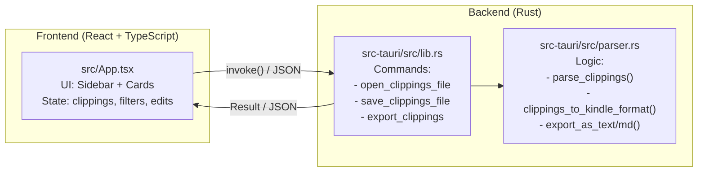

# Clippings Parser

A desktop app for browsing, filtering, editing, and exporting your Kindle highlights and notes — built with **Tauri 2**, **Rust**, **React** and **TypeScript**.

## Download

Grab the latest installer from the [Releases](https://github.com/Mahboob22-bit/clippings-parser/releases) page:

| Platform | Format | Description |
|----------|--------|-------------|
| Windows  | `.exe` (NSIS) | Setup wizard installer |
| Linux    | `.deb` | For Debian / Ubuntu |
| Linux    | `.rpm` | For Fedora / Red Hat |
| Linux    | `.AppImage` | Portable — runs on any distro, no install needed |

## Features

- **Load** your `My Clippings.txt` file directly from the app
- **Filter by book** — pick any title from the sidebar
- **Filter by date range** — narrow results to a specific period
- **Full-text search** — search across all highlights, notes, and book titles
- **Type filter** — toggle Highlights, Notes, and Bookmarks independently
- **Sort** — by date (newest/oldest first) or by page (ascending/descending)
- **Edit** highlights and notes inline
- **Delete** individual clippings or paired notes
- **Add notes** to any highlight
- **Auto-save** — all changes are written back to the original file instantly
- **Kindle-compatible** — the file keeps its original format, ready to copy back to your Kindle
- **Duplicate detection** — identical clippings at the same position are merged on import
- **Note pairing** — Kindle notes are automatically matched to the highlight they belong to
- **Export** filtered results as `.txt` or `.md` (Markdown, grouped by book)

## Tech Stack

| Layer    | Technology                          |
|----------|-------------------------------------|
| Shell    | [Tauri 2](https://tauri.app) (Rust) |
| Parser   | Rust (`src-tauri/src/parser.rs`)    |
| Frontend | React 19 + TypeScript               |
| Bundler  | Vite                                |

## Architecture



The frontend calls Rust functions via Tauri's `invoke()` IPC bridge. Data is serialized as JSON (via `serde`). The file is read once on open, all edits happen in memory, and changes are written back atomically on every mutation.

## Getting Started

### Prerequisites

- [Rust](https://rustup.rs) (stable toolchain)
- [Node.js](https://nodejs.org) 18+
- [Tauri CLI prerequisites](https://tauri.app/start/prerequisites/) for your OS

### Install & Run

```bash
npm install
npm run tauri dev
```

### Build locally

```bash
npm run tauri build
```

The installer will be placed under `src-tauri/target/release/bundle/`.

## Usage

1. Click **"Datei oeffnen"** and select your `My Clippings.txt` file (from your Kindle or a backup).
2. Use the **book list** in the sidebar to select a specific title (or leave it on "Alle Buecher").
3. Use **text search**, **type toggles**, **date range**, and **sort order** to narrow results.
4. Browse your highlights and notes in the card list.
5. **Edit** a highlight or note by clicking the pencil icon on the card.
6. **Delete** a clipping with the trash icon (with confirmation).
7. **Add a note** to any highlight that doesn't have one yet.
8. Click **"Export .txt"** or **"Export .md"** to save filtered results to a new file.

## Clippings File Format

The app parses the standard Kindle clippings format (German UI):

```
==========
Book Title (Author Name)
- Ihre Markierung auf Seite 42 | bei Position 640-641 | Hinzugefuegt am ...
The highlighted text goes here.
==========
```

Supported entry types: `Markierung` (Highlight), `Notiz` (Note), `Lesezeichen` (Bookmark).

## License

MIT
